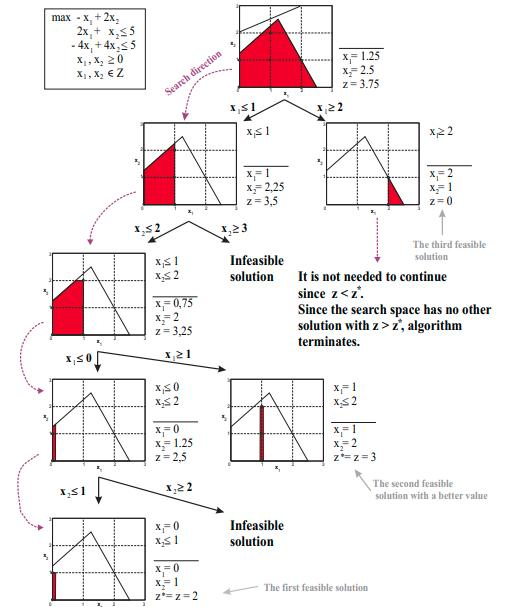
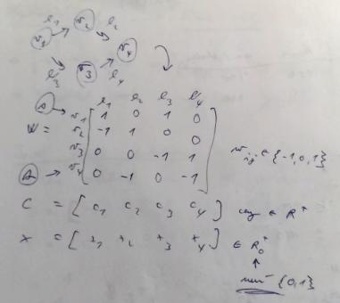
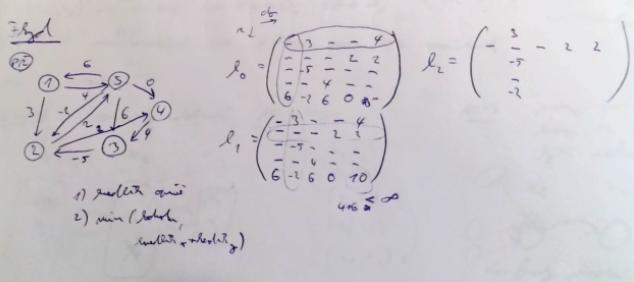
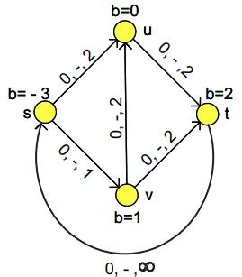
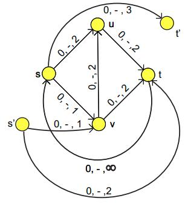
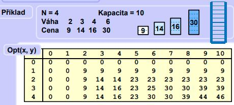
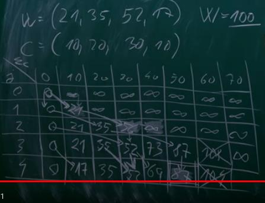

----------
## Integer Linear Programming. Shortest paths problem and traveling salesman problem ILP formulations. Branch and Bound algorithm. Problem formulations using ILP. Special ILP problems solvable in polynomial time.

**ILP**
- Najít $\boldsymbol{x} \in \mathbb{Z}^n$, aby pro soustavu $\boldsymbol{A}\boldsymbol{x} \leq \boldsymbol{b}$ a $\boldsymbol{c}^\top\boldsymbol{x}$ bylo maxiální.
- Je to NP-těžká úloha.
- Nemá konvexní prostor řešení.

**Branch & Bound**
    - Řešení ILP
```
def ilp(A, b, c, z_best, x_best):
    z_lp, x_lp = lp(A, b, c)
    if x_lp is infeasible:
        return -inf, None
    if z_lp <= z_best:         # Protože řešení ILP jsou stejné nebo horší než LP. 
        return z_best, x_best  # Horší LP řešení nezlepší ILP, takže konec.
    if x_lp is integer vector:
        return z_lp, x_lp
    x_i = some_noniteger(x_lp)
    for A_half, b_half in extended(x_i, A, b)  # Rodělnení prostoru řešení na 2 poloviny.
        z_ilp, x_ilp = ilp(A_half, b_half, c, z_best, x_best)
        if z_ilp > z_best:
            z_best, x_best = z_ilp, x_ilp
    return z_best, x_best
```


**Základní úlohy pro $x_1, x_2 \in \{0,1\}$**
- $x_1 = 1 \implies x_2 = 1$
    - $x_1 \leq x_2$
- $x_2 = 1 \implies x_1 = 0$
    - $x_1 + x_2 \leq 1$
- $w = x_1 \land x_2$
    - $w \geq x_1 + x_2 - 1$
- $w = x_1 \lor x_2$
    - $w \leq x_1 + x_2, w \geq x_1, y \geq x_2$
- $w = x_1 ~XOR~ x_2$
    - $w = x_1 + x_2 - 2a$
    - $a \leq x_1$
    - $a \leq x_2$
    - $a \geq x_1 + x_2 - 1$
    - $a \in \{0,1\}$
- Alespoň 2 constrainty naplněny: $x_1 \geq 50, x_2 \leq 25, x_3 + x_4 \leq 100$
    - Pomocná proměnná $\boldsymbol{w} \in \{0,1\}^3$, platí $\sum_{i = 1,2,3} w_i \geq 2$
    - $x_1 \geq 50 - M(1-w_1)$
    - $x_2 \leq 25 + M(1-w_2)$
    - $x_3 + x_4 \leq 100 + M(1-w_3)$

**Formulace úloh**
- *2 partition* 
    - Chceme rozdlit bankovky do 2 skupin, aby měly stejnou cenu.
    - min $0$
    - s.t.
        - $\sum_{i = 1 \dots n} x_i \cdot p_i = 0.5 \sum_{i = 1 \dots n} p_i$
        - $\boldsymbol{x} \in \{0,1\}^{n}$ (proměnná), $\boldsymbol{p} \in \mathbb{Z}_+^n$, $n$ počet bankovek
- *Nejkraší cesty v grafu s nezápornými hranami*
    - Dostaneme matici incidence a ceny hran.
    - min $\sum_{j = 1 \dots m} c_j \cdot x_j$
    - s.t.
        - $\sum_{j = 1 \dots m} w_{s,j} x_j = 1$ (vylezeme ze startovního)
        - $\sum_{j = 1 \dots m} w_{i,j} x_j = 0$ (do ostatních jednou vlezeme a vylezeme)
        - $\sum_{j = 1 \dots m} w_{t,j} x_j = -1$ (do cílového vlezeme)
        - $\boldsymbol{w} \in \{-1, 0, 1\}^{n \times m}$ - matice incidence, kde řádky odpovídají vrcholům, sloupce hranám, $\boldsymbol{x} \in \mathbb{R}^m_{0+}$ (proměnná), $\boldsymbol{c} \in \mathbb{R}^m_{0+}$
    - 
- *Obchodní cestující*
    - Dostaneme matici sousednosti s cenami.
    - min $\sum_{i = 1 \dots n, j = 1 \dots m} c_{i,j} \cdot x_{i,j}$
    - s.t.
        - $\forall i \in \{1 \dots n\}:\sum_{j = 1 \dots m} x_{i,j} = 1$ (jednou vlezeme do vrcholu)
        - $\forall j \in \{1 \dots m\}: \sum_{i = 1 \dots n} x_{i,j} = 1$ (jednou vylezeme z vrcholu)
        - $\forall i \in \{1 \dots n\}, j \in \{2 \dots m\}: M(1-x_{i,j}) + s_j \geq s_i + c_{i,j}$
            - Eliminuje podcykly. S tímto je možné mít jen jeden cyklus.
            - $s$ určuje čas vrkročení do vrcholu. V cyklu postupně narůstá.
        - $\boldsymbol{c} \in \mathbb{R}_{0+}^{n \times n}$, $\boldsymbol{x} \in \{0,1\}^{n \times n}$ (proměnná), $M \in \mathbb{Z}_+$, $\boldsymbol{s} \in \mathbb{R}_{0+}^n$
- *Catering*  $1|r_j d_j|C_{max}$
    - Dostaneme seznam jídel, kde každé jídlo má $r$ - ready time, $p$ - processing time, $d$ - deadline.
    - Chceme určit $s$ - start time, pro každé jídlo.
    - min $C_{max}$
    - s.t.
        - $\forall i \in \{1 \dots n\}: C_{max} \geq s_i + p_i$ ($C_{max}$ je poslední čas dokončení)
        - $\forall i \in \{1 \dots n\}: s_i \geq r_i$ (lze začít připravovat, že je jídlo připravené)
        - $\forall i \in \{1 \dots n\}: d_i \geq s_i + p_i$ (jídlo se musí připravit do deadlinu)
        - $\forall i \in \{1 \dots n\}, j \in \{1 \dots i-1\}: s_j \geq s_i + p_i - M(1-x_{i,j})$ (aby se příprava 2 jídel nepřekrývala)
        - $\forall i \in \{1 \dots n\}, j \in \{1 \dots i-1\}: s_i \geq s_j + p_j - Mx_{i,j}$ (aby se příprava 2 jídel nepřekrývala)
            - $x_{i,j} \in \{0,1\}$ označuje, že se $i$-té jídlo připravilo před $j$-tým jídlem.
        - $\boldsymbol{r}, \boldsymbol{p}, \boldsymbol{d}, \boldsymbol{s} \in \mathbb{R}_{0+}^n, C_{max} \in \mathbb{R}_{0+}, \boldsymbol{x} \in \{0,1\}^{n \times n}$
- *MaxFlow* (LP)
    - Dostaneme graf $G = (V,E)$, lower boundy $l$, upper boundy $u$ hran, startovní $s$ a cílový uzel $t$.
    - max $\sum_{e \in \delta_+(s)} f(e) - \sum_{e \in \delta_-(s)} f(e)$
    - s.t.
        - $\forall v \in V \setminus \{s, t\}: \sum_{e \in \delta_+(v)} f(e) = \sum_{e \in \delta_-(v)} f(e)$ (Kirhoffův zákon)
        - $\forall e \in E: l(e) \leq f(e) \leq u(e)$ (Feasible flow)
- *MinCostFlow* (LP)
    - Dostaneme graf $G = (V,E)$, lower boundy $l$, upper boundy $u$ hran, ceny hran $c$ a balance uzlů $b$.
    - min $\sum_{e \in E} c(e) \cdot f(e)$
    - s.t.
        - $\forall v \in V: \sum_{e \in \delta_+(v)} f(e) - \sum_{e \in \delta_-(v)} f(e) = b(v)$ (definice balance)
        - $\forall e \in E: l(e) \leq f(e) \leq u(e)$ (Feasible flow)

----------
## Shortest paths problem. Dijkstra, Bellman-Ford, and Floyd–Warshall algorithms. Shortest paths in directed acyclic graphs. Problem formulations using shortest paths.

Podobné problémy:
- *Nejdelší cesty* - lze přenásobit váhy -1 a řešit nejkratší cesty
- *Záporné váhy* - jsou ok, dokud nevytvoří záporné cykly
    - Záporné cykly způsobí úlohu NP-těžkou.
        - Důkaz jde udělat rekucí na úlohu existence hamiltonovského cyklu.
    - Pokud graf nemá cyklus záporné váhy, pak platí trojúhelníková nerovnost.

**Bellmanův princip optimality**
- Máme nejkratší cestu až do $P^k(s,w)$ s nejvýše $k$ hranami. Pokud vyndáme poslední hranu $(v,w)$ v $P^k$, tak $P^{k-1}(s,v)$ je také nejkratší cestou.
- Důskedkem toho se dá utvořit Bellmanova rovnice $l(s,w) = \min_{v \neq w} \{l(s,v) + c(v,w)\}$ popisující, jak přidat nejkratší cestu v další vrstvě.

**Dikstrův algoritmus**
- Prohledávání do šířky s expanzí na nejnižší ceně a možným nahrazením fronty za prioritní frontu.
- Předpokládá nezáporné váhy.
- Čas:
    - $O(n^2)$ naivně,
    - $O(n \log~n)$ s prioritní frontou.
- [Příklad](https://youtu.be/LCTwYILbmEY?t=991)

**Bellmann-Fordův algoritmus**
-   Algoritmus:
    1.  V grafu vrcholům přiřadím hodnotu $\infty$ a startu hodnotu 0
    2.  $i = 1$
    3.  Projde všechny hrany $(u,v)$ v grafu a vždy s zeptá zda nezlepší $v$ pomocí hodnoty $u$ + ceny hrany $(u,v)$
    4.  $i = i + 1$
    5.  Pokud $i < n$ a zároveň v bodě 3 vylepšil alespoň jednu hranu, goto 3.
- Funguje se zápornými váhami a umí detekovat záporné cykly.
- Čas: $O(mn)$
- [Příkald 1](https://youtu.be/LCTwYILbmEY?t=6558)
- [Příklad 2](https://youtu.be/LCTwYILbmEY?t=7823)

**Floyd-Warshallův algoritmus**
- Vytvoří matici všech párů nejtraších cest.
- Jeden krok algoritmu:
    - 
- [Příklad](https://youtu.be/eFLIzXDeJ6U?t=3518)
- Čas: $O(n^3)$

**(Johnsonův algoritmus)**
- Počítá také páry.
- Dobrý na řídké grafy.
- Kombinuje Dijkstru a Bellman-Forda.
- Čas: $O(mn \log n)$

----------
## Network flows. Maximum flow and minimum cut problems. Ford-Fulkerson algorithm. Feasible flow with balances. Minimum cost flow and cycle-canceling algorithm. Problem formulations using network flows. Maximum cardinality matching.

*Síť* je definovaná jako pětice $(G, l, u, s, t)$, kde
-   $G$ - orientovaný graf
-   $l$ - lower bound hran
-   $u$ - upper bound hran
-   $s$ - startovní vrchol
-   $t$ - koncový vrchol

**Kirhoffův zákon** - suma toho, co vteče je stejné jako suma toho, co vyteče z uzlu.

**Ford-Fulkersonův algoritmus**
- Algoritmus:
    1. Najít (jakýkoliv) proveditelný tok.
    2. Najít zlepšující cestu, pokud není, konec -> už máme max flow.
    3. Vypočítat $\gamma$ - kapacitu zlepšující cesty a změnit tok na cestě mezi $s$ a $t$ o $\gamma$.
- *Zlepšující cesta*
    - Pokud je nalezena, potom lze přidat (ubrat) tok dopředné (zpětné) hrany.
    - Kapacita je definována jako $$\gamma = \min \{\min_{e \text{~is forward}} u(e)-f(e), \min_{e \text{~is backward}} f(e)-l(e)\}$$
- Jeden krok algoritmu:
    - 
- *Intergral flow theorem*: Pokud má síť celočíselné kapacity a existuje přípustný tok. pak existuje celočíselný MaxFlow.
- Čas: $O(|E|^2 \cdot |V|)$ - pokud se použije BFS na hledání zlepšující cesty.
- Úlohy:
    - [Příklad: Redukce Scheduling to MaxFlow](https://youtu.be/eFLIzXDeJ6U?t=6356)
    - [Příklad: Dynamic flow](https://youtu.be/eFLIzXDeJ6U?t=7479)
    - [Příklad: Rozřazování obyvatel](https://youtu.be/xK3xiyEfG-k?t=3879)
    - [Příklad: Zaokrouhlování tabulky](https://youtu.be/xK3xiyEfG-k?t=4494)

**Minimální řez**
- Je souvislá podmnožina uzlů, která obshuje $s$ a neobsahuje $t$.
- Platí, že hrany vedoucí z/do minimálního řezu jsou saturované -> najde bottleneck toku.
- *Ford-Fulerosnova věta*: Min-cut lze najít na takovém uzlu, kde platí (najde ho Ford-Fulkersonův algoritmus): $$\sum_{e \in \delta_+(v)} f(e) - \sum_{e \in \delta_-(v)} f(e) = \sum_{e \in \delta_+(v)} u(e) - \sum_{e \in \delta_-(v)} l(e)$$
- [Příklad: Transport pohonných hmot pro tank](https://youtu.be/xK3xiyEfG-k?t=2412)

**Nalezení iniciálního toku pro FF algoritmus**:
- Přes redukce: *MaxFlow* -> *Feasible Flow with Balances and zero lower bounds* -> *MaxFlow with zero lower bounds*
    - První redukce: balance se spočítá jako: $$b(v) = \sum_{e \in \delta_-(v)} l(e) - \sum_{e \in \delta_+(v)} l(e)$$
    - Druhá redukce: Pokud je balance záporná, spojí s $t'$, pokud je balance kladná, tak s $s'$.
- Příklad redukcí:
    -   

**MinCostFlow**
- Podobné, jako Max-Flow, ale každá hrana má cenu a každý uzel má balanci.
- Cílem je najít tok, který minimalizuje celkovou cenu a splňuje balance v každém uzlu.
- MaxFlow $\leq_{Karp}$ MinCostFlow
- *Cycle canceling algoritmus*
    - Funguje podobně, jako FF algoritmus.
    - Liší se v kroku hledání zlepšující cesty - místo toho hledá cyklus záporné ceny v residuálním grafu:
    - [Sestavení residuálního grafu](https://youtu.be/71B1FMVVX_o?t=640)
        - 
        - Tok se vylepší tak, že po sestavení residuálního grafu:
            1. Najde cyklus záporné ceny.
            2. Podle minimálního upper boundu v cyklu sníží tok v nalezeném cyklu.

----------
## Knapsack problem. Approximation algorithm, dynamic programming approach, approximation scheme.

**Neomezený Knapsack**
- Lze řešit redukcí na maximální cestu v DAG, kde uzel je kapacita a ceny hran určují přidávání předmětů.
- Postupné přidávání kapacit odpovídá Bellmanově principu optimality.

**0/1 Knapsack**
- Každý předmět lze použít nejvýše jednou.
- S celočíselnými váhami jde řešit jako:
    - 
    - `cache[x,y] = max(cache[x-1, y], cache[x-1, y - w[x]] + c[x])`
    - Řádky - index předmětu, Sloupce - kapacita
- S celočíselnými cenami jde řešit jako:
    - 
    - `cache[x,y] = min(cache[x-1, y], cache[x-1, y - c[x]] + w[x])`
    - Řádky - index předmětu, Sloupce - cena
- Čas: $O(n \cdot C)$, kde $C$ je velká konstanta a roste exponenciálně s velikostí kapacity.

**Fractional Knapsack**
- Povolí se částečné přidání předmětu.
- Existuje polynomální algoritmus:
    1. Pokud je součet vah menší než kapacita batohu, triviální řešení.
    2. Seřadí položky podle cena/váha.
    3. Postupně vkládá, dokud nenarazí na konec kapacity.
    4. Pokud se poslední předmět celý nevešel, tak přidá jen zlomek $\frac{W - \sum_{i = 1}^{h-1} w_i}{w_h}$.
- Čas: $O(n \log n)$, ale jde i $O(n)$

**r-aproximační algoritmy**
- Algoritmus $A$ je r-aproximační, pokud existuje $r \geq 1: r \cdot J^{A}(I) \geq J^*(I)$, kde $J$ je nějaká užitková funkce.
- Fractional knapsack je 2-aproximační algoritmus pro knapsack se složitostí $O(n)$

**Aproximační schéma**
- Detaily moc nechápu, ale celkově to chce zrychlit algoritmus za cenu menší přesnotí řešení aproximačním faktorem $\epsilon$.
- Postup:
    1. Pustí 2-aproximační knapsack. Dostane řešení $S_1$.
    2. $t = \max \{1, \frac{\epsilon \cdot S_1}{n}\}; \boldsymbol{c}' = \frac{\boldsymbol{c}}{t}$
    3. Vyřeší upravený knapsack s vektorem cen $\boldsymbol{c}'$ přes DP. Dostane řešení $S_2$.
    4. Vrátí lepší řešení z $S_1$, $S_2$.

----------
## Traveling salesman problem. Double-tree algorithm and Christofides algorithm for the metric problem. Local search k-OPT

**Traveling salesman problem (TSP)**
- Dostane se úplný graf a ceny hran.
- Cílem je najít nejmenší hamiltonovský cyklus.

**Strongly NP-hard**
- Úloha je *silně NP-těžká*, pokud existuje polynom $p$, který omezuje parametry všech instancí v závislosti na velikosti instance.
- Lidsky řečeno, úloha je silně NP-těžká, pokud neexistuje pseudo-polynomiální algoritmus, který ji řeší.
- *TSP je strongly NP-hard*.
    - Dokáže se redukcí  EHC $\leq_{karp}$ 2-TSP:
    - Pro libovolný graf pro EHC sestrojí úplný pro 2-TSP, kde:
        - Existující hrany mají váhu 1.
        - Přidané hrany mají váhu 2.
    - Hamiltonovská kružnice existuje právě tehdy, když celková cena řešení 2-TSP je rovna počtu uzlů -> Redukce ok.
    - Protože (přepokládám) EHC je silně NP, pak je 2-TSP silně NP-těžké.

**Metrické TSP**
- Navíc platí trojúhelníková nerovnost.
- *Nearest Neighbor*
    - Při hledání kružnice jde do nejbližšího nenavštíveného uzlu.
    - Je to heuristika, není to aproximace.
- **Double Tree algoritmus**
    - Algoritmus:
        1. Najde minimální kostru.
        2. Zdvojí každou hranu v minimální kostře.
        3. Najde eulerovský tah v kostře - dostane posloupnost uzlů.
        4. Každý první výskyt uzlu z tahu zůstane. To celkem utvoří hamiltonovský cyklus.
    - 
        - Eulerovský tah: A B C B A D A E A
        - Hamiltonovská kružnice: A B C D E A
    - Je to 2-aproximace metrického TSP.
- **Christophides algoritmus**
    - Algoritmus:
        1. Najde minimální kostru.
        2. Vybere uzly, které mají sudý stupeň a spočte na nich minimální párovaní (ze vstupního grafu).
        3. Hrany z párování přidá do minimální kostry.
        4. Najde eulerovský tah v kostře - dostane posloupnost uzlů.
        5. Každý první výskyt uzlu z tahu zůstane. To celkem utvoří hamiltonovský cyklus.
    - 
        - Eulerovský tah: A B C E A D A
        - Hamiltonovská kružnice: A B C E D A
    - Je to 3/2-aproximace metrického TSP.

----------
## Scheduling - problem description and notation. One resource - Bratley algorithm, Horn algorithm. Parallel identical resources - list scheduling, dynamic programming. Project scheduling with temporal constraints - relative order and time-indexed ILP formulations.

Definice rozvrhování
- Dostaneme $n$ úloh $\mathcal{T} = \{T_1 ,\dots T_n\}$.
- Máme $m$ druhů zdrojů s kapacitou $R_k$, dáno jako $\mathcal{P} = \{P_1^1, \dots, P_{R_1}^1, P_{R_1}^2, \dots, P_{R_2}^2, \dots, P_1^m, \dots, P_{R_m}^m\}$
- Úkolem je přiřadit úlohu ke zdroji v čase tak, aby se všechny úlohy včas dokončily.

Scheduling notace:
- *Offline* - známe předem všechny úlohy.
- *Online* - spuštění jedné úlohy může přinést nebo spustit jinou.
- *Preempce* - práci lze přerušovat.
- Parametry:
    - $r_j$ - *release date*
    - $p_j$ - *processing time*
    - $\tilde{d}_j$ - *deadline*
    - $d_j$ - *due date* (po nestihnutí se platí penalizace)
- Proměnné
    - $s_j$ - *start time*
    - $C_j$ - *completion time*
    - $F_j = C_j - r_j$ - flow, lead time
    - $L_j = C_j - d_j$ - *lateness*
    - $T_j = \max \{0, c_j - d_j \}$ - tardiness (poněkud nešťastné značení, když už se takto značí úloha)

Grahamova notace
- [Scheduling Zoo](http://schedulingzoo.lip6.fr/)
- $\alpha | \beta | \gamma$ -> resources | tasks | criterion \*
- Resources:
    - Typy:
        - 1 - jeden procesor
        - P - identické paralelní procesory
        - Q - paralelní procesory a každý má jiný výkon
        - R - nezávislé procesory, kde každá úloha zabere jiný čas na jiném procesoru
        - O - *open shop*, každá úloha se skládá z několika operací, kde operace mohou být splněny v libovolném pořadí
        - F - *flow shop*, každá úloha se skládá z několika operací, kde operace mohou být splněny v daném pořadí jedním procesorem
        - J - *job shop*, každá úloha se skládá z několika operací, kde operace mohou být splněny v daném pořadí a nějakými dedikovanými procesory
    - Počty:
        - $\emptyset$ - neomezeně
        - 1 - jeden procesor
        - 2 - dva procesory
        - m, R - m procesorů s R kapacitami
- Tasks:
    - $\beta_1$ - *pmtn* (povolená preeemce) nebo $\emptyset$ (zakázaná preempce)
    - $\beta_2$ - *prec* (precedentní omezení), in-tree/out-tree (stromové omezení), chain (zřetězené omezení), *tmpn* (časové omezení), $\emptyset$ (nezávislé úlohy)
    - $\beta_3$ - $r_j$ (zadán pouze release time)
    - $\beta_4$ - $p_j = k$ (rovnoměrné processing time), $p_L \leq p_j \leq p_U$ (omezený processing time), $\emptyset$ (libovolný processing time)
    - ...
    - $\beta_8$ - set-up (čas pro překonfigurování procesoru)
- Criterion:
    - $C_{max}$ - minimalizuje čas dokončení poslední úlohy
    - $\sum C_j$ - minimalizuje součet časů dokončení
    - $\sum w_j C_j$ - minimalizuje vážený součet časů dokončení
    - $L_{max}$ - minimalizuje zpoždění $\max \{C_j - d_j\}$
    - $\emptyset$ - rozhodovací úloha
\* To v kurzívě mi přijde důležité. Ostatní je jen pro přehled a doufám, že komise bude rozumná a nezeptá se, co znamená $\beta_7$.

Úlohy s jedním procesorem
- $1 | prec | C_{max}$ - lehké
    - Topologicky uspořádat a postupně vyřešit.
- $1 | | C_{max}$ - lehké
- $1 | r_j | C_{max}$ - lehké
    - Seřadit podle $r_j$ a postupně vyřešit.
- $1 | \tilde{d}_j | C_{max}$ - lehké
    - Vyřeší se jako earliest deadline first (EDF).
- $1 | r_j; \tilde{d}_j | C_{max}$ - silně NP-těžké
    - (Catering problem)
    - Dokázat se dá redukcí 3-PART $\leq_{karp} 1 | r_j, \tilde{d}_j | C_{max}$
    - **Bratley algoritmus**
        - Prochází strom volání do hloubky postupným přidáváním úloh.
        - S každým vstupem si udržuje čas dokončení $c$ aktuálně vybraných úloh.
        - Prořezává ještě chytřeji, než Branch & Bound:
            1. *Missed deadline*: konec, pokud ze zbývajících úloh existuje taková, že $d_j < c + p_j$ (přesněji $d_j < \max\{c, r_j\} + p_j$, ale to potom nemá řešení?)
            2. *Bound on the solution*: konec, pokud nastane $LB \geq UB$, kde $$LB = \max \{c, \min_{i \in \text{todo}} r_i \} + \sum_{i \in todo} p_i ~,~ UB = \max_{i \in todo} d_i$$ Později se UB nastaví na *best so far* $c_{best}$, až se najde přípustné řešení.
            3. *Decomposition*:  $c \leq \min_{i \in todo} r_j \implies$ no backtrack, protože zbývající úlohy už nemohou být spuštěny dříve, než v $c$.
- $1 | | \sum C_j$ - lehké
    - Vyřeší se jako shortest processing time first (SPT).
- $1 | | \sum w_j C_j$ - lehké
    - Vyřeší se jako weighted shortest processing time first (SPT), podle $p_j/w_j$.
- $1 | r_j | \sum C_j$ - silně NP-těžké
- $1 | r_j; pmtn | \sum C_j$ - lehké
- $1 | r_j; pmtn | \sum w_j C_j$ - silně NP-těžké
- $1 | \tilde{d}_j | \sum C_j$ - lehké
- $1 | \tilde{d}_j | \sum w_j C_j$ - NP-těžké
- $1 | prec | \sum C_j$ - silně NP-těžké
- $1 | prec | \sum w_j C_j$ - silně NP-těžké
    - Vyřeší se modifikovaným Branch & Bound
- $1 | | L_{max}$ - lehké
    - Vyřeší se jako earliest due date first (EDD).
- $1 | r_j | L_{max}$ - silně NP-těžké
- $1 | r_j; p_j=1 | L_{max}$ - lehké
- $1 | r_j; pmtm | L_{max}$ - lehké
    - **Horn algoritmus**
        - Ze seznamu připravených úloh spustí nejdříve tu, která má nejnižší deadline.
        - Spočte si, kdy přijde další úloha a provede znovu stejné vyhodnocení.
            - Další úloha přijde za $\delta = min\{p_k, t_2 - t_1 \}$, kde $t_1$ je aktuální čas a $t_2 = \min_{T_j \in \mathcal{T}} \{r_j; r_j > t_1\}$, a $p_k$ je processing time aktuální úlohy.
        - [Příklad](https://youtu.be/MjekjcErKPc?t=708)
        - Čas: $O(n \log n)$
- $1 | r_j; d_j = \tilde{d}_j; pmtm; prec | L_{max}$ - lehké
    - **Chetto, Silly, Bouchentouf algoritmus**
        - Upraví graf, aby šel nasadit Horn algoritmus.
        - Pro všechny následníky postupně upraví release time jako maximum release time a rozdíly release time a processing time předchůdců.
        - Pro všechny předchůdce postupně upraví deadline jako minumum deadline a rozdíly deadline a processing time předchůdců.
        - 
        - [Příklad](https://youtu.be/MjekjcErKPc?t=1874)

Úlohy s více procesory
- $P2 | | C_{max}$ - NP-těžké
    - Jde dokázat redukcí 2-PART $\leq_{karp} P2 | | C_{max}$
- $P | | C_{max}$ - slabě NP-těžký
    - **Rothkopf pseudopolynomiální algoritmus**
        - Pro každý procesor vytvoří novou dimenzi.
        - Iteruje postupně přes úlohy a vkládá, kdy dosavadní posloupnost dokončí každý procesor.
        - 
        - [Příklad](https://youtu.be/MjekjcErKPc?t=5759)
        - Čas: $O(n \cdot \text{UB}^R)$
- $P | pmtn | C_{max}$ - lehké
    - **McNaughton algoritmus**
        - Algoritmus:
            1. Spočte $C_{max}^* = max\{\max p_i, \frac{1}{R} \sum_{1}^{n} p_i\}$
            2. Do "krabice" $R \times C_{max}^*$ postupně vpáskuje všechny úlohy.
        - 
        - [Příklad](https://youtu.be/MjekjcErKPc?t=3452)
        - Čas: $O(n)$
- $P | r_j; \tilde{d}_j | -$ - lehké
    - [Rozhodovací MaxFlow](https://youtu.be/eFLIzXDeJ6U?t=6356)
- $P | prec | C_{max}$ - NP-těžký
    - **List scheduling algoritmus**
        - Je to obecná heuristika.
        - Může mít anomálie, závislé na seřazení $L$ a navíc může zvýšit $C_{max}$:
            - Přidání dalšího procesoru.
            - Snížením $p_j$.
            - Odstraněním závislostí.
        - Algoritmus:
            1. Každý procesor má čas dokončení aktuální úlohy $t_i$
            2. Seřadí úlohy do listu $L$ (podle čeho záleží na konkrétní strategii).
            3. Pro každou úlohu:
                1. Vybere úlohy, které mají nejnižší availability time $a_j$ a potom úlohu nejníže v $L$.
                2. Vyndá úlohu $T_i$ z $L$, nechá ji zpracovat procesorem s nejnižším $t_k$ a přepočítá jeho $t_k$.
        - Availability time $a_i$ je pro kořeny $r_j$, pro následníky nejprve $\infty$ a pokud je nějaký předchůdce dokončen, tak je to $\max \{s_j + p_j\}$ předchůdců.
- $P | pmtn; prec | C_{max}$ - NP-těžký
    - **Muntz & Coffman algoritmus**
        - Funguje jako list scheduling.
        - Úlohy seřadí podle *level* - suma nejdelší $p_j$ od dané úlohy až po list jeho nejvzdálenějšího následníka
        - Protože je povolna preepmce, úlohy spravedlivě rozřazuje do všech procesorů. Způsob rozřazení se konkrétně spočítá přes McNaughtonův algoritmus.
        - Čas: $O(n^2)$
----------
## Constraint Satisfaction Problem. AC3 algorithm.

Pojmy:
- *Proměnná* - neznámá hodnota, kterou optimalizujeme.
- *Stav* - definice výsledku úlohy po přiřazení proměnné.
- *Doména* - možné hodnoty každé proměnné.
- *Omezení (constraint)* - pravidla omezující problém.

**CSP**
- Propaguje omezení do domén proměnných.
- Např. pro $x_1 = \{1,2,3\}, x_2 = \{1,2,3\}$ a omezení $x_1 < x_2$ dostaneme $x_1 = \{1,2\}, x_2 = \{2,3\}$.
- Pokud se dostane do dalšího stavu, provede propagaci znovu.
- Když najde přípustné řešení, končí.
- NP-úplný
- Výhody:
    - Umí složité relace (narozdíl od ILP)
    - Je více open-source
- Nevýhody:
    - Složité pro spojité úlohy.

**AC-3**
- *Hrana (arc) $(x,y)$ je konzistetní* právě tehdy když pro jakékoliv přiřazení do $x$ existuje přiřazení do $y$ takové, že se splní všechny omezení.
- *CSP je konzistetní* právě tehdy když všechny hrany jsou konzistentní.
- Algoritmus *Revise*:
    1. Vytvoří si frontu všech orintovaných hran.
    2. Dokud není fronta prázdná, Dequeue -> $(x_1, x_2)$
    3. Ověří, že pro každou hodnotu domény $x_1$ existuje hodnota v $x_2$
    4. Pokud pro nějakou hodnotu neexistuje, vyřadí ji z domény $x_1$ a provede další krok, jinak goto 2.
    5. Enqueue $(*,x_1)$ (dá do fronty všechny hrany, které vedou do $x_1$).
- 